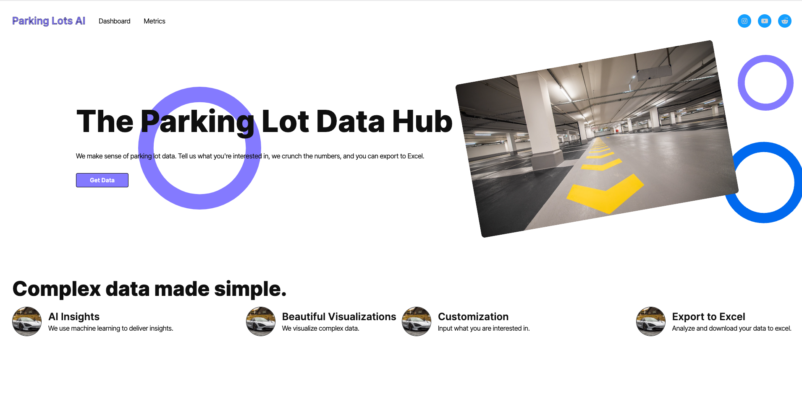
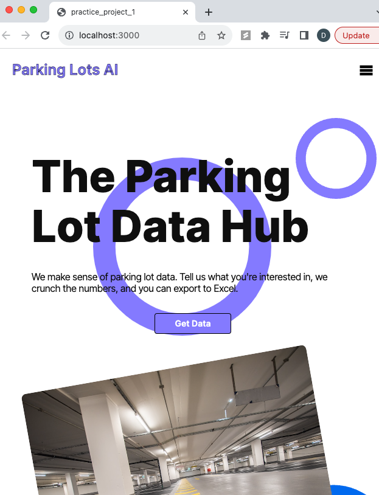

# practiceproject1-React

I wanted to find a way to speed up frontend development for my projects.
Simulataneously, I wanted to acheive higher quality, elegant, clean, and repsonsive designs.

I found out about tools like Anima and TeleportHQ which allow users to create designs 
without code but then export code for further development. While developers may be 
against low-code or no-code solutions due to code quality, 
I think the time saved by these products makes it worth it (at least for my purposes). 

I tried Anima with the Figma plugin previously but ultimately it did not stick. 
This was an attempt to use TeleportHQ. Overall, I was happy with the results. 
There is room for improvement and I will get better as I practice.

To run:
```shell
npm install
npm start
```
Remember to add node_modules to .gitignore because it's a big file

The website I designed is basically 
for a service that analyzes parking lot data across the U.S.

Example screenshots:

Desktop: 




Mobile:


